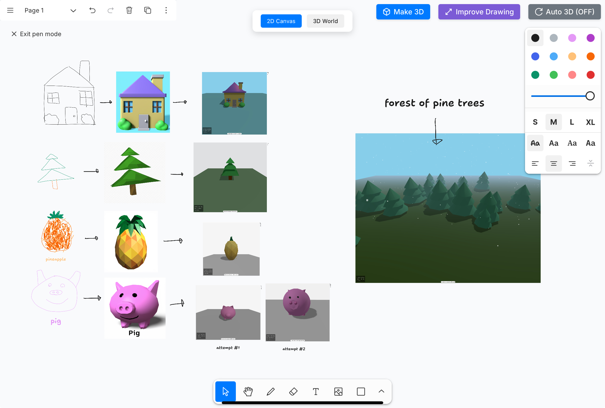
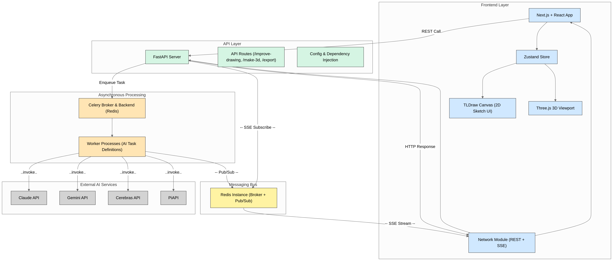

<div align="center">
    
</div>

<h1 align="center">
    AI Canvas – Cursor for 3D Modeling
</h1>

<p align="center">
   Turn your roughest sketches into stunning 3D worlds with AI-powered drawing.
</p>

<p align="center">
  <b>Built with love by the Vibe Coders team 💡</b>
</p>

---




---

## ✨ Overview

**AI Canvas** is an intuitive, multimodal creation tool that empowers anyone to turn freehand sketches and rough writings into polished, colorful 3D models.

- ✏️ Freehand sketching on an infinite 2D canvas  
- 🧠 AI-powered conversion from sketch to realistic 3D models  
- 🌍 Seamless drag-and-drop into a dynamic 3D world  
- 📤 Export and share your creations  
- ⚡ Real-time responsiveness with advanced AI model integration  

---

## 🧠 How It Works

1. **Sketch** – Draw freely on the 2D canvas  
2. **Enhance** – Use Gemini Flash to improve sketch quality  
3. **Transform** – Claude + Cerebras convert sketches to 3D model code  
4. **Render** – Three.js displays the model in the 3D world  
5. **Build** – Add models to an immersive 3D scene  
6. **Export** – Export your 3D world as a `.glTF` file with one click

---

## 🧩 Architecture

### Frontend
- **Next.js & React** – Responsive, modern UI
- **Three.js** – Renders dynamic 3D scenes
- **TLDraw** – Infinite 2D sketching canvas
- **Zustand** – Lightweight global state management

### Backend
- **FastAPI** – High-performance Python backend
- **Celery** – Handles heavy AI tasks asynchronously
- **Redis** – Real-time pub/sub and task state
- **SSE (Server-Sent Events)** – Live progress streaming

### AI Models
- **Gemini Flash 2.0** – Enhances sketch quality  
- **Claude Sonnet 3.7** – Converts prompts into 3D model logic  
- **Cerebras Llama 3.3 70B** – Extracts modular 3D code  
- **PiAPI** – (optional) Text/image interface

---

## 🧩 Challenges We Overcame

- Interpreting varied sketch quality into accurate 3D forms  
- Prompt engineering across multimodal AI systems  
- Maintaining speed and performance with heavy AI tasks  
- Building a smooth user experience from sketch to render

---

## 🏆 Accomplishments

- Seamless real-time integration of multiple AI models  
- Intuitive experience for users of all skill levels  
- Visual validation of sketch-to-3D conversion in action

---

## 🛣️ What’s Next

- 🤝 Real-time multi-user collaboration  
- 🥽 AR/VR support for immersive creation  
- 🎯 Improved AI understanding of complex sketches  

---

## 🏗 Diagram



---

## ⚡ Quick Start

### Prerequisites

- Node.js 18+
- Python 3.10+
- API keys for Claude, Gemini, Cerebras, and PiAPI

---

### 🔧 Frontend Setup

```bash
cd frontend
npm install
npm run dev

```
## 🔧 Backend Setup
```bash

cd backend

# Add your API keys
cp .env.example .env

docker compose up

```
# Team
Made with ❤️ by Vibe Coders
— Hackathon 2025 Project

#📄 License
This project is licensed under the MIT License.


